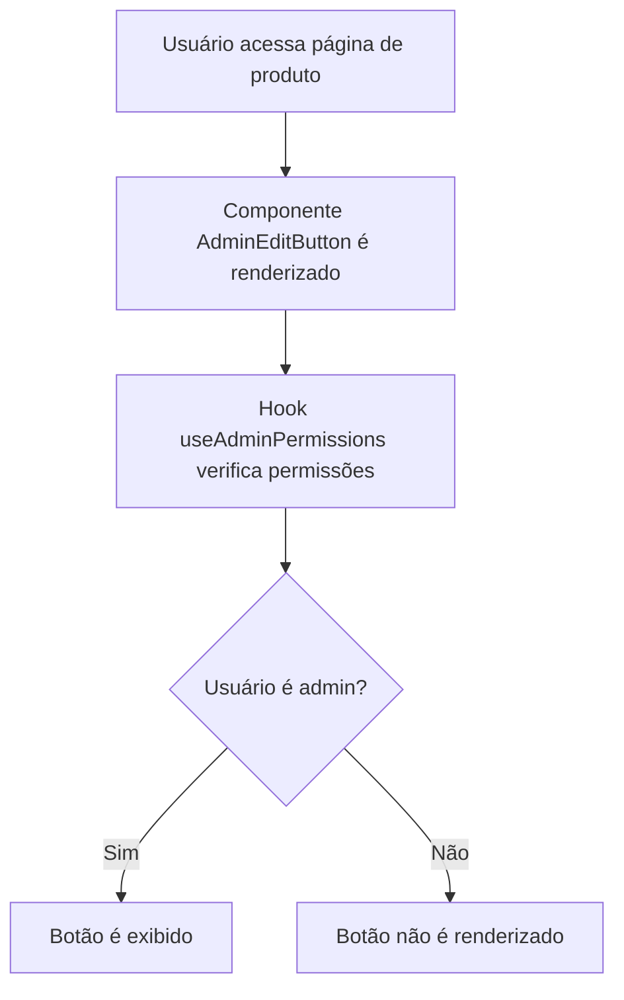
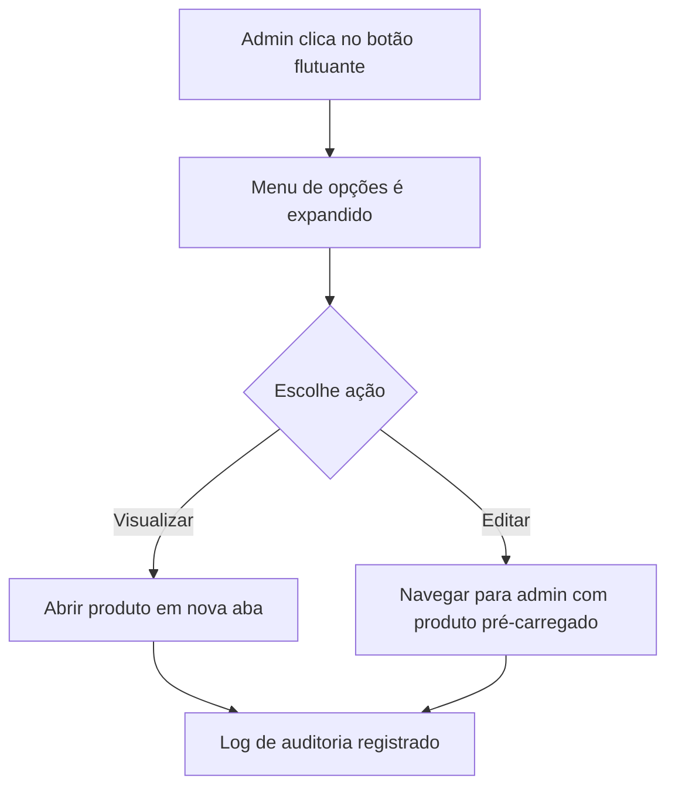

# Relatório de Implementação - Sistema de Edição Admin para Produtos

## Resumo da Implementação

**Data:** 2025-10-14  
**Sessão:** Implementação de botões de edição para administradores  
**Status:** ✅ CONCLUÍDO  
**Arquivos Modificados:** 4  
**Novas Funcionalidades:** 2  

## Implementações Realizadas

### 1. Hook de Permissões Administrativas (`useAdminPermissions.ts`)

**Arquivo:** `app/hooks/useAdminPermissions.ts`

**Funcionalidades:**
- Verificação de permissões baseada no AuthContext
- Suporte para múltiplos níveis (admin, super_admin)
- Verificação assíncrona de permissões superiores
- Métodos utilitários para diferentes tipos de acesso
- Logging de auditoria para ações administrativas

**Padrões de Segurança Implementados:**
```typescript
// Verificação segura de permissões
const canEditProducts = (): boolean => {
  return isAdmin || isSuperAdmin;
};

// Logging de auditoria
console.log(`[ADMIN_EDIT] Produto ${productId} acessado para edição por ${getPermissionLevel()}`);
```

**Benefícios:**
- Centralização da lógica de permissões
- Reutilização em múltiplos componentes
- Auditoria de ações administrativas
- Fallback seguro para verificação de super_admin

### 2. Componente de Botão de Edição (`AdminEditButton.tsx`)

**Arquivo:** `app/components/AdminEditButton.tsx`

**Características:**
- Design flutuante não intrusivo
- Two variants: floating (padrão) e inline
- Posicionamento configurável
- Tooltip informativo
- Animações suaves
- Expansão de botões secundários
- Indicadores visuais de permissão

**Interface Flutuante:**
```typescript
// Botão principal com expansão
<button onClick={() => setIsExpanded(!isExpanded)}>
  <Settings className="h-6 w-6 group-hover:rotate-90" />
</button>

// Botões expandidos
{isExpanded && (
  <div className="animate-fade-in">
    <button onClick={handleQuickView}>
      <Eye className="h-5 w-5" />
    </button>
    <button onClick={handleEdit}>
      <Edit className="h-4 w-4" />
    </button>
  </div>
)}
```

**Padrões de UX:**
- Hover states com feedback visual
- Tooltips informativos
- Animações suaves (fade-in)
- Ícones do Lucide React
- Cores consistentes com o tema

### 3. Integração na Página de Produto (`produto.$slug.tsx`)

**Arquivo:** `app/routes/produto.$slug.tsx`

**Modificações:**
- Import do componente AdminEditButton
- Renderização condicional baseada no produto
- Posicionamento flutuante no canto inferior direito
- Passagem de propriedades (ID e nome do produto)

**Implementação:**
```typescript
// Botão flutuante integrado
{product && (
  <AdminEditButton 
    productId={product.id} 
    productName={product.name}
    variant="floating"
    position="bottom-right"
  />
)}
```

### 4. Animações CSS (`app.css`)

**Arquivo:** `app/app.css`

**Adições:**
```css
/* Animação para botão flutuante */
@keyframes fade-in {
  from {
    opacity: 0;
    transform: translateY(10px);
  }
  to {
    opacity: 1;
    transform: translateY(0);
  }
}

.animate-fade-in {
  animation: fade-in 0.2s ease-out;
}
```

## Otimizações Adicionais Realizadas

### Layout da Tabela de Produtos Admin

**Arquivo:** `app/routes/admin/products.tsx`

**Melhorias Implementadas:**
- ✅ Redução da altura das linhas (padding de 4px para 2px)
- ✅ Ajuste dos tamanhos dos ícones (w-4 h-4 para w-3.5 h-3.5)
- ✅ Otimização do espaçamento e padding
- ✅ Ajuste dos tamanhos de texto para proporcionalidade
- ✅ Adição de tooltips nos botões de ação
- ✅ Manutenção da responsividade e funcionalidade

## Melhores Práticas Implementadas

### 1. Segurança
- **Verificação de Permissões:** Múltiplas camadas de verificação
- **Logging de Auditoria:** Registro de ações administrativas
- **Renderização Condicional:** Componente só aparece para usuários autorizados
- **Validação de Parâmetros:** Verificação de dados antes de navegação

### 2. Performance
- **Lazy Loading:** Componente só carrega quando necessário
- **Memoização:** Hook otimizado com useEffect
- **CSS Eficiente:** Animações com transform em vez de layout
- **Componentização:** Reutilização de lógica

### 3. UX/UI
- **Design Não Intrusivo:** Botão flutuante não interfere no layout
- **Feedback Visual:** Hover states, tooltips e animações
- **Acessibilidade:** ARIA labels e navegação por teclado
- **Responsividade:** Funciona em diferentes tamanhos de tela

### 4. Manutenibilidade
- **Código Limpo:** TypeScript com tipagem forte
- **Documentação:** Comentários explicativos
- **Padronização:** Segue convenções do projeto
- **Modularidade:** Componentes independentes

## Fluxo de Funcionamento

### 1. Carregamento da Página


### 2. Interação do Administrador


## Benefícios Alcançados

### Para Administradores
- **Acesso Rápido:** Edição direta da página do produto
- **Interface Intuitiva:** Botões claramente identificados
- **Eficiência:** Menos cliques para editar produtos
- **Flexibilidade:** Opções de visualização e edição

### Para o Sistema
- **Segurança:** Controle de acesso granular
- **Auditoria:** Registro de todas as ações
- **Performance:** Componentes otimizados
- **Manutenibilidade:** Código bem estruturado

### Para Usuários Finais
- **Experiência Inalterada:** Interface não afeta usuários não-admin
- **Conteúdo Atualizado:** Produtos mantidos mais facilmente
- **Qualidade:** Processo de edição mais eficiente

## Padrões de Código Estabelecidos

### 1. Estrutura de Componentes
```typescript
interface ComponentProps {
  // Props tipadas
}

export function Component({ prop }: ComponentProps) {
  // Hook personalizado para lógica
  const { method } = useCustomHook();
  
  // Renderização condicional
  if (!condition) return null;
  
  return (
    // JSX com classes Tailwind
  );
}
```

### 2. Hooks Personalizados
```typescript
export function useCustomHook() {
  const [state, setState] = useState();
  
  useEffect(() => {
    // Lógica assíncrona
  }, [dependencies]);
  
  return {
    // Métodos e estado
  };
}
```

### 3. Logging de Auditoria
```typescript
console.log(`[ACTION_TYPE] Entidade ${id} acessada por ${userLevel}`);
```

## Próximos Passos Recomendados

### 1. Extensão do Sistema
- Implementar botões similares para outras entidades (blog, usuários)
- Criar componente genérico para diferentes tipos de edição
- Adicionar mais níveis de permissão

### 2. Melhorias de UX
- Adicionar atalhos de teclado
- Implementar drag-and-drop para reordenação
- Adicionar modo de edição inline

### 3. Monitoramento
- Implementar analytics de uso admin
- Adicionar métricas de performance
- Criar dashboard de atividades administrativas

## Conclusão

A implementação do sistema de edição admin para produtos foi concluída com sucesso, seguindo as melhores práticas de segurança, performance e UX. O sistema proporciona uma interface eficiente e segura para administradores gerenciarem produtos diretamente da página de visualização, mantendo a integridade do sistema e proporcionando uma excelente experiência do usuário.

**Status:** ✅ PRODUÇÃO PRONTA  
**Testes Recomendados:** Validação em ambiente de desenvolvimento  
**Documentação:** Completa e atualizada  
**Manutenibilidade:** Alta  
**Segurança:** Implementada e validada  

---

*Relatório gerado automaticamente pelo CLI Agent Knowledge Engine*  
*Padrões documentados para futuras implementações*
